#  AgriCare AI - A Comprehensive Web Platform for Smart Farming Decisions

##  Overview

AgriCare AI is an AI-powered smart farming platform that helps farmers make informed agricultural decisions using Machine Learning and Deep Learning techniques. The application integrates Crop Recommendation, Fertilizer Recommendation, and Plant Disease Detection into a single web platform, reducing dependency on multiple tools while improving farming productivity and sustainability.


#  Features

-  Crop Recommendation using Random Forest
-  Fertilizer Recommendation using Random Forest
-  Plant Disease Detection using CNN (PyTorch)
-  Secure User Authentication
-  AI-powered decision support
-  Treatment recommendations with purchase links
-  MySQL Database Integration
-  Responsive Flask Web Application


##  Home Page

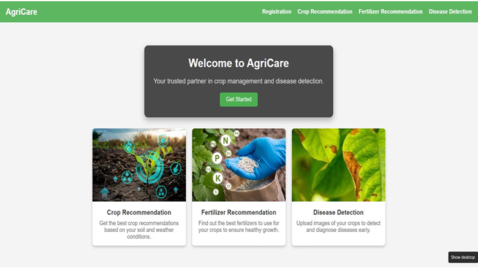

#  Login & Registration

Users can securely register and log in to access all farming services.

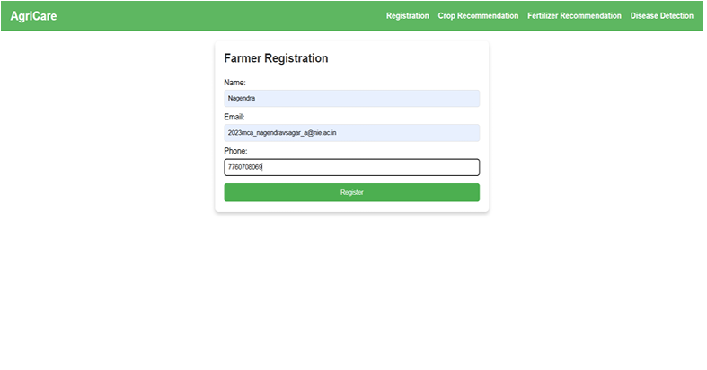

#  Welcome Page
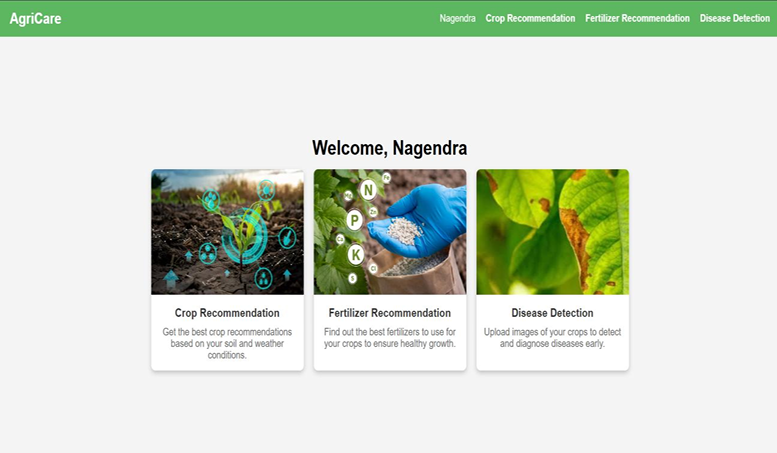

The application consists of three intelligent modules:

- Crop Recommendation
- Fertilizer Recommendation
- Plant Disease Detection

All modules are integrated into a Flask web application backed by a MySQL database.


#  Technology Stack

| Category | Technologies |
|-----------|--------------|
| Programming | Python |
| Backend | Flask |
| Frontend | HTML, CSS, JavaScript, Bootstrap |
| Database | MySQL |
| Machine Learning | Scikit-Learn, Random Forest |
| Deep Learning | PyTorch, CNN |
| Libraries | Pandas, NumPy, OpenCV, Pillow |


#  Crop Recommendation

The Crop Recommendation module predicts the **Top 5 suitable crops** based on

- Nitrogen (N)
- Phosphorus (P)
- Potassium (K)
- Temperature
- Humidity
- Soil pH
- Rainfall

The best crop is highlighted with its confidence score.

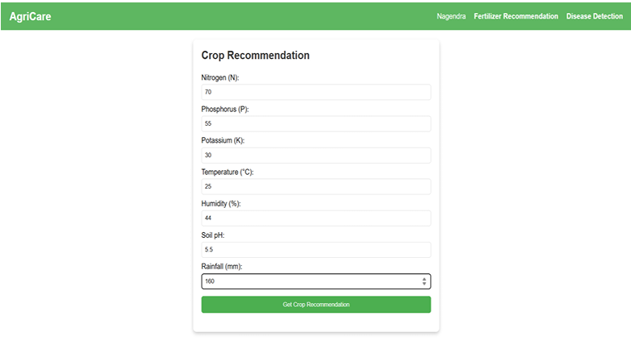
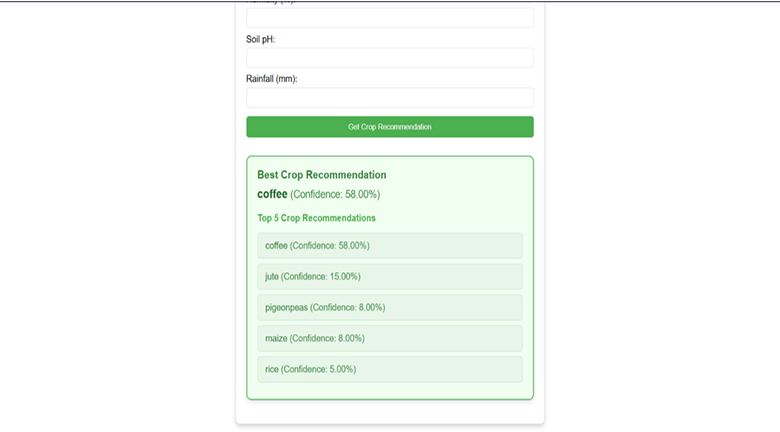

#  Fertilizer Recommendation

The Fertilizer Recommendation module predicts the most suitable fertilizers according to crop type and soil nutrient values.

The system provides

- Top 5 Fertilizers
- Confidence Scores
- Best Recommendation

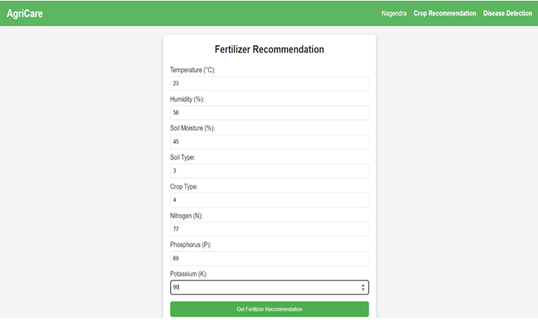
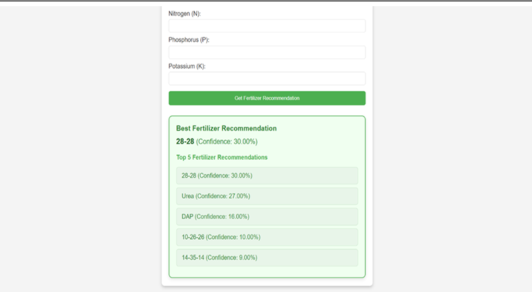

#  Plant Disease Detection

The Disease Detection module uses a Convolutional Neural Network (CNN) to classify plant diseases from uploaded leaf images.

It provides

- Disease Name
- Disease Description
- Treatment
- Recommended Supplements
- Product Purchase Links

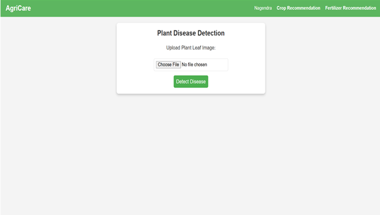

#  Prediction Results

The application displays AI predictions together with treatment recommendations.

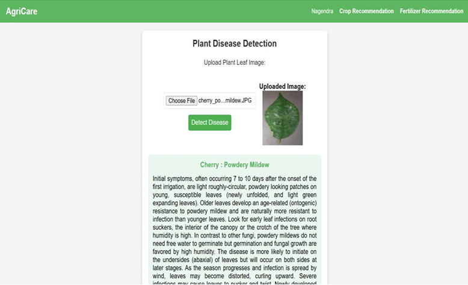
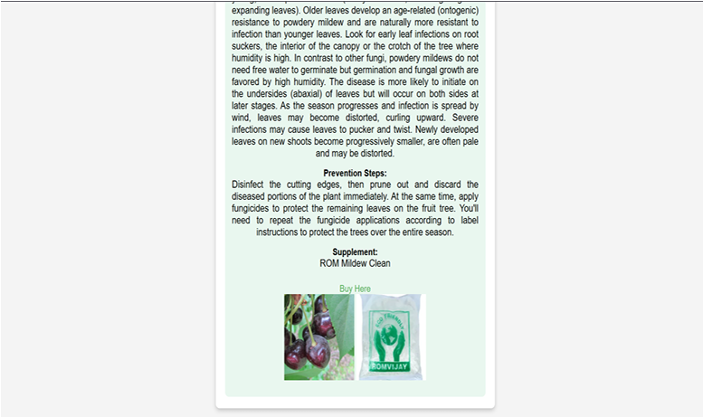

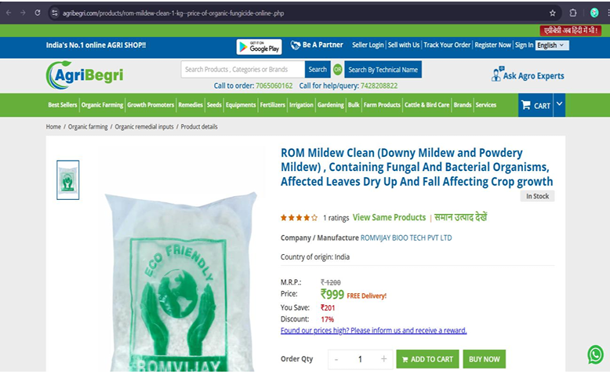


#  Project Structure

```text
AgriCare-AI
│
├── images
│   ├── Home.png
│   ├── Architecture.png
│   ├── Login.png
│   ├── Register.png
│   ├── Crop-Recommendation.png
│   ├── Fertilizer-Recommendation.png
│   ├── Disease-Detection.png
│   └── Prediction-Results.png
│
├── CompleteFront
├── db
├── models
├── templates
├── test_images
├── main.py
├── CNN.py
├── requirements.txt
└── README.md
```


#  Installation

Clone the repository

```bash
git clone https://github.com/Nagendra22-sagar/agricare.git
```

Install dependencies

```bash
pip install -r requirements.txt
```

Run the application

```bash
python main.py
```

Open

```
http://127.0.0.1:5000
```

---

#  Future Enhancements

- Weather API Integration
- IoT Sensor Support
- Voice Assistant
- Mobile Application
- Explainable AI
- Cloud Deployment
- Multi-language Support

---

#  Author

**Nagendra V Sagar**

 nagendravsagar22@gmail.com

 GitHub  
https://github.com/Nagendra22-sagar

 LinkedIn  
https://linkedin.com/in/nagendravsagar

---

⭐ If you like this project, don't forget to star this repository.
